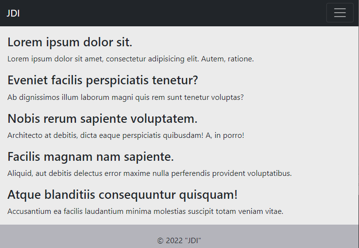

# Home Server React Redux DRF

SPA проект домашнего сервера для управления умным домом. Включает в себя современные технологии 
написания Web приложений. Позволяет пользователю получать доступ к информации и управлению.
В качестве базы данных используется PostgreSQL, а в качестве ORM выступает DRF. 
Frontend написан на ReactJS с использованием хранилища Redux. Весь проект можно развернуть с помощью docker-compose 
с небольшими предварительными настройками. Проект в стадии разработки. На основной ветке разработки master
происходить автоматический deploy через github actions.

## Технологии
1. Python
2. Django REST framework
3. JavaScript
4. React
5. Redux
6. HTML CSS
7. PostgreSQL
8. Nginx
9. Docker compose

### Главная страница

### Страница о нас

### Страница логина

### Адаптив на разные устройства

